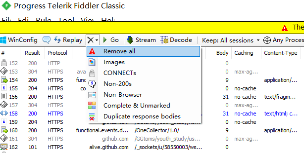
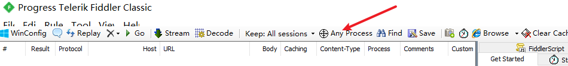
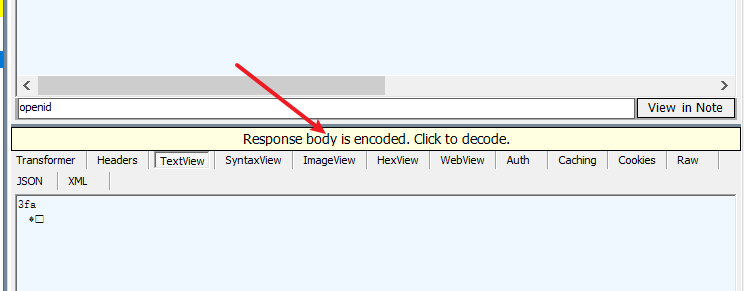
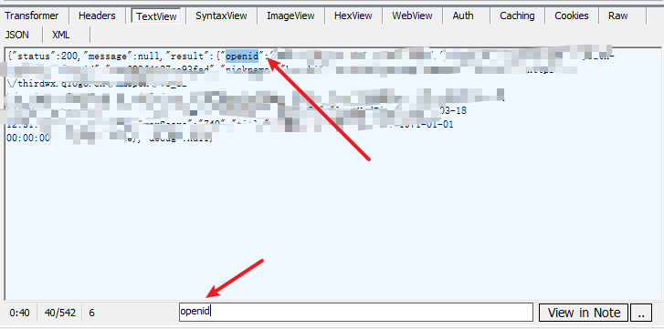
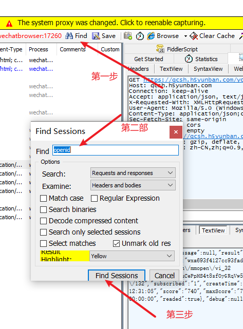

# 青年大学习自动脚本
## 说明
如果你足够懒，就来看看吧。
## 运行方法
- 将python脚本和json文件下载到本地，或者上传到服务器
- 修改json数据，添加openid作为key，{}作为值
- 运行

json数据类似下面
```json
{
    "openid1": {},
    "openid2":{}
}
```

## 抓取openid的方法

1. 需要pc版微信和[Fiddler]([Download Fiddler Web Debugging Tool for Free by Telerik](https://www.telerik.com/download/fiddler))

2. 打开fiddler

3. 微信进入青年大学习页面

   

4. fiddler锁定这个页面

   4.1 清除fiddler其他请求信息

   

   4.2如果有黄色的条条需要点一下。

   4.3

   长按这个选项鼠标会变成十字形，然后拖到青年大学习的页面

5. 微信关闭大学习页面（直接叉掉），并重新进入

6. 找到和这个请求差不多的

   

7. 点击这个灰色的条，如果幸运的话，这条就是openid的请求

   

   

8. 如果没找到就多找几条，肯定有一条。可以先把类似的请求都点一遍，把第七步灰色的条条都点了，然后在进行下面的操作，里面会有一条用黄色标注的请求，那条就是有openid的请求。

9. 

## 程序运行需要注意

- openid需要自己抓包获取，我目前没有找到能够自动获取openid的方法。
- 第一次运行较慢，因为要获取团组织信息，并且要储存到本地
- callback，appid，sign还有其他url可能并不通用，至少在上海这个应该是通用的。如果其他地区需要自己抓包修改。
- 已默认开启图片下载

